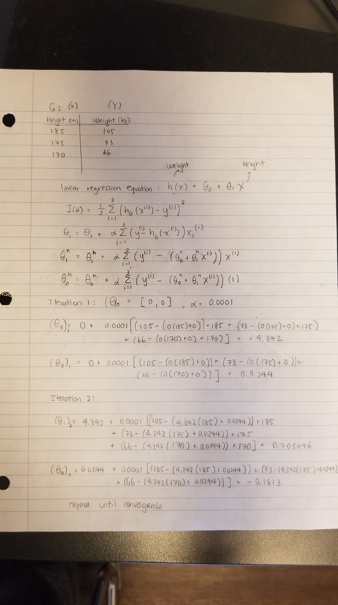

<!-- You can check templates from this website and change html theme: https://www.datadreaming.org/post/r-markdown-theme-gallery/ -->
<!-- It won't affect the PDF or Word. -->


## Question 1: Linear Regression


### 1.1. (10 pts) 

Give basic insights into your numeric variable you have picked as output variable using one categorical variable you selected. 

- What are the min / max values and median of the output variable, $Y$?
- What is median of the output value among different classes of the categorical variable you picked? You must use `group_by` and `summarize` functions.


```{r}
library('tidyverse')
Anime<- read.csv('data/anime.csv') %>%
  na.omit(anime)
anime <- subset(Anime, 
                genre %in% c('Action', 'Drama', 'Space', 'Comedy', 'Supernatural', 'Fantasy'))
rmarkdown::paged_table(anime)
```
```{r}
anime %>% 
  select(score) %>% 
  summarize(score_max = max(score),
            score_min = min(score))
```

```{r}
anime %>% 
  select(score, genre) %>% 
  group_by(genre) %>% 
  summarise(score_median = median(score),
            score_max  = max(score),
            score_min = min(score))
```

### 1.2. (10 pts) 

Visualize the variables you selected.

- Draw histogram of the numeric variables you selected.
```{r}
ggplot(anime, aes(x=score)) + 
  geom_histogram(colour='white') 
```

- Draw distribution of the output variable $Y$ with respect to the different classes of your categorical variable. The plot must somehow show the distributional differences among different classes. You can use boxplot, histogram, or other visuals (e.g. density ringes).
```{r}
ggplot(anime, aes(x=score, y=genre, colour=genre)) + 
  geom_boxplot() 
```

- Draw scatter plot between one of your numeric inputs and the output variable. Discuss whether the plot indicate a relation, if it is linear, if there are outliers? Feel free to remove the outlier. Feel free to transform the data.

```{r}
ggplot(anime, aes(y=score, x=rank, colour=genre)) + 
  geom_point() 
```
The plot does indicate a relationship between score and rank.  There is a linear region in the data from approximately ranks 1000-8000.  The other regions exhibit a more exponential relationship.  There are several outliers in the data, which can be completely removed by filtering using scored_by > 1000.  These scores are outliers as they have not been scored by enough people to be statistically significant hence why the rank of the anime is so low.  

### 1.3. (15 pts) 

Using the all dataset, fit a regression:

1. Using the one numeric input variable fit a simple regression model.

  - Write down the model.
	- Fit the regression line.
	- Summarize the output.
	- Plot the input and output variables in a scatter plot and add the predicted values as a line.
	- Interpret the results. Is it a good fit? Is your input variable good in explaining the outputs?
```{r}
fit1 <- lm(score ~ rank, data = Anime)
fit1
```
```{r}
summary(fit1)
```
```{r}
preds <- predict(fit1)
ggplot(Anime, aes(y=score, x=rank)) + 
  geom_point(alpha=.3, size=2) + 
  geom_line(aes(y=preds), colour="red")
```

```{r}
library('ggExtra')
g <- ggplot(Anime, aes(y=log(score), x=log(rank), colour=genre)) + 
  geom_point(alpha=.3) + 
  theme(legend.position = 'none') 
ggMarginal(g, type='histogram')
```
Low residual standard error (0.2013) and high R-squared value (0.9188) in this case demonstrates that this is a good fit. Also, the Pr(>|t|) value is relatively small indicating the current feature(rank) has significant statistically impact on the target variable. However, the estimated coefficient is very small meaning it does not actually influence the target variable that much.   

2. Using all your input variables, fit a multiple linear regression model

   - Write down the model
   - Fit the regression line and summarize the output
   - Interpret the results. Is it a good fit? Are the input variables good in explaining the outputs?

```{r}
fit2 <- lm(score ~ rank + members + genre, data = Anime)
summary(fit2)$coefficients
```
```{r}
sigma(fit1)
sigma(fit2)
```
RMSE of this fit is slightly lower than fit 1 which indicates it is a better fit. The p-value estimates for coefficient of rank and members are relative smaller comparing to the other variable. This means rank and members seem to have more significant impacts towards the score. 

3. Now, do the same things as you did, but this time add an interaction between one categorical and one numeric variable.
   - Write down the model, fit to the data, summarize and interpret the results.
```{r}
fit3 <- lm(score ~ rank + members + genre + members:genre, data = Anime)
summary(fit3)$coefficients
```
```{r}
sigma(fit3)
```
Adding more variables decreased the RMSE value demonstrating it is a better fit than fit2. All variables have relative small p values. Meantime, it is noticeable that the estimated coefficients of genre alone seems to be relatively higher than that of the interacting variable, members:genre. This shows the impact of interaction between members and genre may not influence the score that much. 

4. Which model you fit is the best in predicting the output variable? Which one is the second and third best? Rank the models based on their performance.
Lower RMSE values indicates the model has a better fit. Thus, fit 3 > fit 2 > fit 1.
### 1.4. (15 pts) 

In this section, you will do the same you did in 1.3, but this time you will first split the data into train and test.

- Select seed to fix the random numbers you will generate using `set.seed(...)`. 
- Split your data into test and train sets with 20/80 test-train ratio. 
- Fit the model to the train set and evaluate the how well the model performed on test set.
- Which model performed the best on test set? Rank the models based ion their performance.
- Is the rank the same as the one you had in 1.3?
```{r}
set.seed(156) # Set seed is needed if we want 
# to get the same random numbers always
train_size <- floor(0.8 * nrow(Anime))
train_inds <- sample(1:nrow(Anime), size = train_size)
test_inds  <- setdiff(1:nrow(Anime), train_inds)

train <- Anime[ train_inds , ] 
test  <- Anime[ test_inds , ]

cat('train size:', nrow(train), '\ntest size:', nrow(test))
```

```{r}
library('caret')
fit1 <- lm(score ~ rank, data = train)
fit2 <- lm(score ~ rank + members + genre, data = train)
fit3 <- lm(score ~ rank + members + genre + members:genre, data = train)


pred1 <- predict(fit1, newdata=test)
pred2 <- predict(fit2, newdata=test)
pred3 <- predict(fit3, newdata=test)


rmse1 <- RMSE(pred1, test$score)
rmse2 <- RMSE(pred2, test$score)
rmse3 <- RMSE(pred3, test$score)


rmses <- c(rmse1,rmse2,rmse3)
rmses
```
The models are ranked as the following. Performance rating: fit3 > fit2 > fit1. This is the same as the one we had in 1.3. 
\pagebreak

## Question 2: Gradient Descent Algorithm (By hand)

In case you want to take a picture (screenshot) of your notebook (tablet), you can use the below lines to embed the image to the output PDF file:


```{r,results='asis'}
library('knitr')
#X
X <- c(185,175,170)
#Y
Y <- c(105,73,66)
column.names <- c("Height (cm)","Weight (kg)")
row.names <- c("","","")
result <- array(c(X,Y),dim = c(3,2),dimnames = list(row.names,column.names))
kable(result,caption = 'Simple Dataset')
```
Hypothesis function $h_{\theta}(x) = {\theta_0} +{\theta_1}x$
Let ${\theta_0}$ = 0
${\theta_1}$ = 0 
$\alpha$ = 0.0001

```{r}

```


\pagebreak

## Question 3. Gradient Descent Algorithm


### 3.1. Get familiar

You will use horsepower as input variable and miles per gallon (mpg) as output:

1. Plot the scatterplot between `mpg` ($Y$) and `horsepower` ($X$).
    - Is the relationship positive or negative? Does mpg increase or reduce as horsepower increases?
    - Is the relationship linear?
```{r}
library('ISLR')
ggplot(Auto, aes(y=mpg, x=horsepower)) + 
  geom_point() 
```
The relationship is negative where as horsepower increases, mpg decreases.  The relationship is non-linear and looks to be logarithmic.
2. Plot the scatterplot between `log(mpg)` and `log(horsepower)`.
    - Is the relationship positive or negative?
    - Is the relationship linear?
```{r}
ggplot(Auto, aes(y=log(mpg), x=log(horsepower))) + 
  geom_point() 
```
The relationship is negative, and linear, which makes sense after applying the log() function on the data above which seemed to have a logarithmic relationship.  
3. Which of the two versions is better for linear regression?
The log data is better for linear regression

### 3.2. Fill in the code

The code below estimates the coefficients of linear regression using gradient descent algorithm. If you are given a single linear regression model;

$$Y = \beta_0 + \beta_1 X $$

where $Y=[Y_1,\dots,Y_N]^T$ and $X=[X_1,\dots,X_N]^T$ are output and input vectors containing the observations.

The algorithm estimates the parameter vector $\theta = [\beta_0,\beta_1]$ by starting with an arbitrary $\theta_0$ and adjusting it with the gradient of the loss function as:

$$\theta := \theta + \frac \alpha N X^T(Y - \theta X)$$

where $\alpha$ is the step size (or learning rate) and $(Y - \theta X)^T X$ is the gradient. At each step it calculates the gradient of the loss and adjusts the parameter set accordingly.


### 3.3. Run GDA


1. Run the code with the above parameters. How many iterations did it take to estimate the parameters?

```{r}
GDA <- function(x, y, theta0, alpha = 0.01, epsilon = 1e-8, max_iter=25000){
  
  # Inputs
  # x      : The input variables (M columns)
  # y      : Output variables    (1 column)
  # theta0 : Initial weight vector (M+1 columns)
  
  x     <- as.matrix(x)
  y     <- as.matrix(y) 
  N     <- nrow(x)
  i     <- 0
  theta <- theta0
  x     <- cbind(1, x) # Adding 1 as first column for intercept
  imprv <- 1e10
  cost  <- (1/(2*N)) * t(x %*% theta - y) %*% (x %*% theta - y)
  delta <- 1
  while(imprv > epsilon & i < max_iter){
    i <- i + 1
    grad <- (t(x) %*% (y-x %*% theta))
    theta <- theta + (alpha / N) * grad
    cost  <- append(cost, (1/(2*N)) * t(x %*% theta - y) %*% (x %*% theta - y))
    imprv <- abs(cost[i+1] - cost[i])
    if((cost[i+1] - cost[i]) > 0) stop("Cost is increasing. Try reducing alpha.")
  }
  if (i==max_iter){print(paste0("maximum interation ", max_iter, " was reached"))} else {
    print(paste0("Finished in ", i, " iterations"))
  }
  
  return(theta)
}
plot_line <- function(theta) {
  ggplot(Auto, aes(x=log(horsepower),y=log(mpg))) + 
    geom_point(alpha=.7) + 
    geom_abline(slope = theta[2], intercept = theta[1], colour='firebrick') + 
    ggtitle(paste0('int: ', round(theta[1],2), ', slope: ', round(theta[2],2)))
}
x <- log(Auto$horsepower)
y <- log(Auto$mpg)
theta0 <- c(1,1)
theta   <- GDA(x, y, theta0, alpha = 0.05, epsilon = 1e-5)
plot_line(theta)
```
It took 3193 iterations to converge on the parameters.

2. Reduce epsilon to `1e-6`, set `alpha=0.05` run the code. 
    - How many iterations did it take to estimate the parameters?
    - Does the result improve? Why or why not?

```{r}
plot_line <- function(theta) {
  ggplot(Auto, aes(x=log(horsepower),y=log(mpg))) + 
    geom_point(alpha=.7) + 
    geom_abline(slope = theta[2], intercept = theta[1], colour='firebrick') + 
    ggtitle(paste0('int: ', round(theta[1],2), ', slope: ', round(theta[2],2)))
}
x <- log(Auto$horsepower)
y <- log(Auto$mpg)
theta0 <- c(1,1)
theta   <- GDA(x, y, theta0, alpha = 0.05, epsilon = 1e-6)
plot_line(theta)
```
After lowering the learning rate, it took 7531 iterations for the algorithm to converge on the parameters. However, by reducing epsilon, the result seems to improve which is counter-intuitive as the algorithm should stop earlier due to the improvements to the function being stopped earlier.  
3. Reduce alpha to `alpha=0.01`
   - How many iterations did it take?
   - Did the resulting line change? Why or why not?

```{r}
plot_line <- function(theta) {
  ggplot(Auto, aes(x=log(horsepower),y=log(mpg))) + 
    geom_point(alpha=.7) + 
    geom_abline(slope = theta[2], intercept = theta[1], colour='firebrick') + 
    ggtitle(paste0('int: ', round(theta[1],2), ', slope: ', round(theta[2],2)))
}
x <- log(Auto$horsepower)
y <- log(Auto$mpg)
theta0 <- c(1,1)
theta   <- GDA(x, y, theta0, alpha = 0.01, epsilon = 1e-6)
plot_line(theta)
```
22490 iterations
The line changes slightly 

4. Set alpha back to `alpha=0.05` and try `theta0=c(1,1)` vs. `theta0=c(1,-1)`:
   - How many iterations did it take? Which is less than the other?
   - Why starting with a negative slope have this effect?
   
  

```{r}
plot_line <- function(theta) {
  ggplot(Auto, aes(x=log(horsepower),y=log(mpg))) + 
    geom_point(alpha=.7) + 
    geom_abline(slope = theta[2], intercept = theta[1], colour='firebrick') + 
    ggtitle(paste0('int: ', round(theta[1],2), ', slope: ', round(theta[2],2)))
}
x <- log(Auto$horsepower)
y <- log(Auto$mpg)
theta0 <- c(1,1)
theta   <- GDA(x, y, theta0, alpha = 0.05, epsilon = 1e-6)
plot_line(theta)
theta0 <- c(1,-1)
theta   <- GDA(x, y, theta0, alpha = 0.05, epsilon = 1e-6)
plot_line(theta)


```
Changing the initial slope to be negative results in 7265 iterations which is less than the positive one which took 7531 iterations.  This is because our initial guess is now closer to the actual data and should converge quicker. 

5. Reduce epsilon to `epsilon = 1e-8` and try `alpha=0.01`, `alpha=0.05` and `alpha=0.1`.
   - What effect does alpha have on iterations and resulting fitted line?
```{r}
plot_line <- function(theta) {
  ggplot(Auto, aes(x=log(horsepower),y=log(mpg))) + 
    geom_point(alpha=.7) + 
    geom_abline(slope = theta[2], intercept = theta[1], colour='firebrick') + 
    ggtitle(paste0('int: ', round(theta[1],2), ', slope: ', round(theta[2],2)))
}
x <- log(Auto$horsepower)
y <- log(Auto$mpg)
theta0 <- c(1,1)
#theta   <- GDA(x, y, theta0, alpha = 0.01, epsilon = 1e-8)
#plot_line(theta)

#theta1   <- GDA(x, y, theta0, alpha = 0.1, epsilon = 1e-8)
#plot_line(theta1)

theta2   <- GDA(x, y, theta0, alpha = 0.05, epsilon = 1e-8)
plot_line(theta2)

```
When running on a high alpha value, it can result in divergence where we will hit the maximum iterations.  However, when it is too low in case alpha = 0.01, it can also not converge fast enough where the result will be sub-optimal after the maximum iterations, this is seen in the graph with the line not as accurately representing the data compared to alpha = 0.05


### 4 BGD vs. SGD
```{r}
BGD <- function(x, y, theta0, alpha = 0.01, epsilon = 1e-8, max_iter=25000){
  
  # Inputs
  # x      : The input variables (M columns)
  # y      : Output variables    (1 column)
  # theta0 : Initial weight vector (M+1 columns)
  
  x     <- as.matrix(x)
  y     <- as.matrix(y) 
  N     <- nrow(x)
  i     <- 0
  theta <- theta0
  x     <- cbind(1, x) # Adding 1 as first column for intercept
  imprv <- 1e10
  cost  <- (1/(2*N)) * t(x %*% theta - y) %*% (x %*% theta - y)
  delta <- 1
  while(imprv > epsilon & i < max_iter){cost
    i <- i + 1
    grad <- 0
    for(j in 1:length(y)){
      grad_chng <- x[j, ] * c(y[j]-x[j, ] %*% theta)
      grad <- grad + grad_chng 
    }
    theta <- theta + (alpha / N) * grad
    cost  <- append(cost, (1/(2*N)) * t(x %*% theta - y) %*% (x %*% theta - y))
    imprv <- abs(cost[i+1] - cost[i])
    if((cost[i+1] - cost[i]) > 0) stop("Cost is increasing. Try reducing alpha.")
  }
  print(paste0("Stopped in ", i, " iterations"))
  
  cost <- cost[-1]
  return(list(theta,cost))
}
```

```{r}
x <- log(Auto$horsepower)
y <- log(Auto$mpg)
res <- BGD(x, y, c(1, -1), alpha = 0.005, epsilon = 1e-5, max_iter = 10)
theta <- res[[1]]
loss  <- res[[2]]
ggplot() + 
  geom_point(aes(x=1:length(loss), y=loss)) +
  labs(x='iteration')
```

```{r}
SGD <- function(x, y, theta0, alpha = 0.01, epsilon = 1e-8, max_iter=25000){
  
  # Inputs
  # x      : The input variables (M columns)
  # y      : Output variables    (1 column)
  # theta0 : Initial weight vector (M+1 columns)
  
  x     <- as.matrix(x)
  y     <- as.matrix(y) 
  N     <- nrow(x)
  i     <- 0
  theta <- theta0
  x     <- cbind(1, x) # Adding 1 as first column for intercept
  imprv <- 1e10
  cost  <- (1/(2*N)) * t(x %*% theta - y) %*% (x %*% theta - y)
  delta <- 1
  while(imprv > epsilon & i < max_iter){cost
    i <- i + 1
    grad <- 0
    for(j in 1:length(y)){
      grad_chng <- x[j, ] * c(y[j]-x[j, ] %*% theta)
      grad <- grad + grad_chng 
    }
    theta <- theta + (alpha / N) * grad
    cost  <- append(cost, (1/(2*N)) * t(x %*% theta - y) %*% (x %*% theta - y))
    imprv <- abs(cost[i+1] - cost[i])
    if((cost[i+1] - cost[i]) > 0) stop("Cost is increasing. Try reducing alpha.")
  }
  print(paste0("Stopped in ", i, " iterations"))
  
  cost <- cost[-1]
  return(list(theta,cost))
}
```
```{r}
x <- log(Auto$horsepower)
y <- log(Auto$mpg)
res <- SGD(x, y, c(1, -1), alpha = 0.005, epsilon = 1e-5, max_iter = 10)
theta <- res[[1]]
loss  <- res[[2]]
ggplot() + 
  geom_point(aes(x=1:length(loss), y=loss)) +
  labs(x='iteration')
```
2.BGD resulted in 
SGD resulted in

